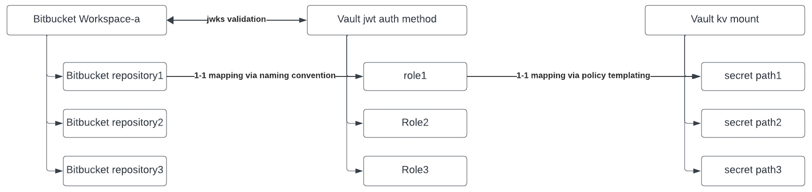

# bitbucket cloud OIDC into HCP Vault

This is a sample project to demonstrate how Bitbucket Cloud pipelines can use it's native OIDC token to log into HCP Vault and get secrets.

## Prerequisites

A working instance of HCP Vault is required. This can be a trial instance or a paid instance.  

A Bitbucket Cloud account is required. This can be a free or paid account.

## Setup

Create a [Bitbucket Cloud app password](https://support.atlassian.com/bitbucket-cloud/docs/create-an-app-password/). This will be used to authenticate to Bitbucket Cloud. Export the values into BITBUCKET_USERNAME and BITBUCKET_PASSWORD environment variables.

Create a HCP Vault admin [token](https://learn.hashicorp.com/tutorials/vault/getting-started-token?in=vault/getting-started). Export the value into VAULT_TOKEN environment variable. Also setup VAULT_ADDR and VAULT_NAMESPACE environment variables.

Create Bitbucket Cloud workspace and repository, enable [pipeline](https://support.atlassian.com/bitbucket-cloud/docs/get-started-with-bitbucket-pipelines/). Get bitbucket cloud workspace name and repository name, provide the values to bitbucket_workspace_name and bitbucket_repository_name terraform variables.

## Usage

```bash
terraform init
terraform plan 
terraform apply -auto-approve
```

The workspace is onboarded into hcp vault as a jwt auth method, which can be used by all repositories under the same workspace. The repository is onboarded into hcp vault as a jwt auth role. Vault access details are added as repository variables. An example bitbucket pipeline file has been provided. The pipeline would login to vault and print the secrets from vault.



## Cleanup

```bash
terraform destroy -auto-approve
```

